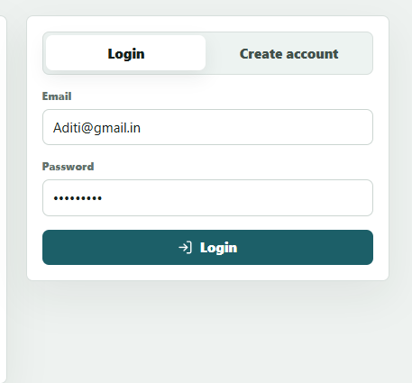
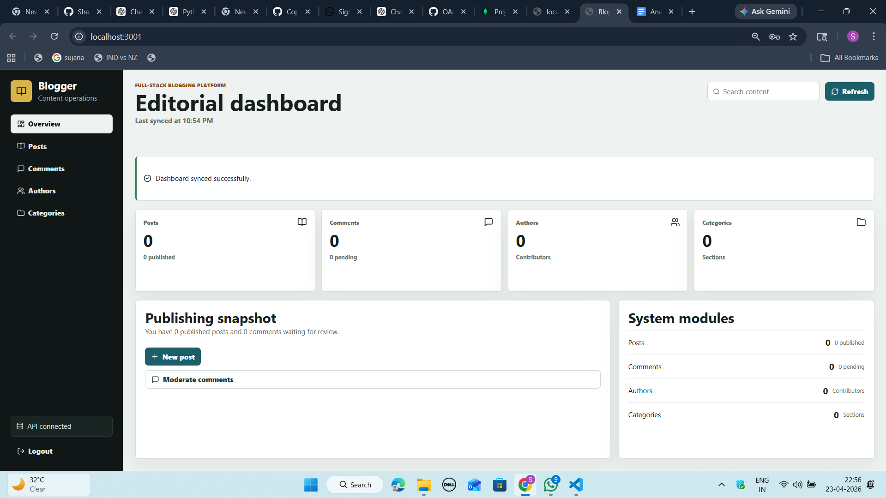
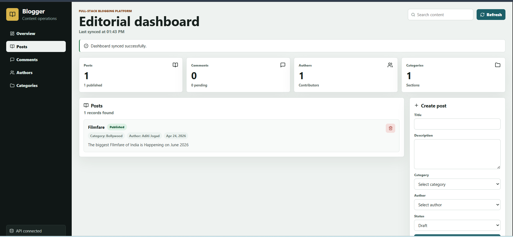
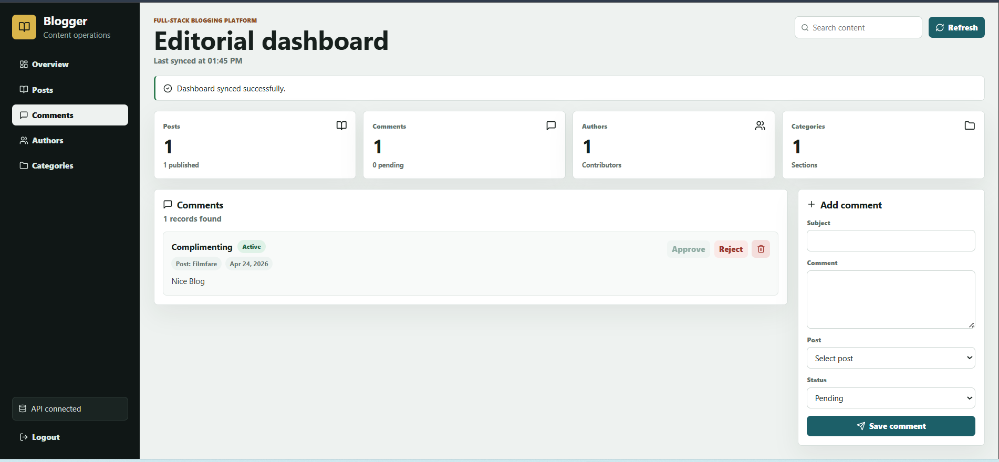
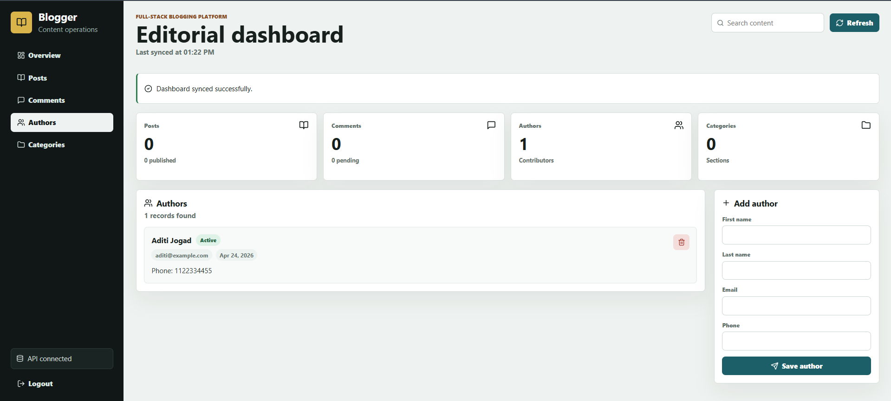
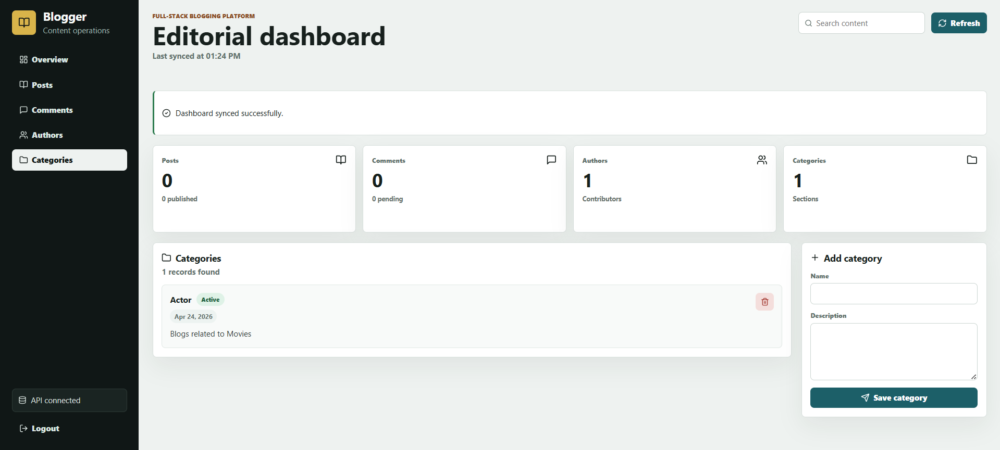

# 🚀 Blogger Platform

A full-stack blogging platform featuring a professional admin dashboard, JWT authentication, MongoDB Atlas support, and a modular backend architecture.

## ✨ Highlights

-   **Admin UI**: Professional interface for managing posts, comments, authors, and categories.
-   **Security**: JWT-based authentication with bcrypt password hashing and secure cookie handling.
-   **Modular Backend**: Built with Node.js, Express, and Mongoose using a service-layer pattern.
-   **Comment Moderation**: Integrated workflow for active, pending, and rejected statuses.
-   **Frontend**: Modern React + Vite setup for a fast and responsive user experience.

## 📸 Screenshots

| Feature        | Preview                                       |
| :------------- | :-------------------------------------------- |
| Authentication |             |
| Dashboard      |           |
| Posts          |                 |
| Comments       |           |
| Authors        |             |
| Categories     |       |

## 🛠️ Tech Stack

### Frontend

-   React & Vite
-   Lucide React (Icons)
-   CSS3

### Backend

-   Node.js & Express
-   MongoDB Atlas & Mongoose
-   JWT (JSON Web Tokens)
-   Bcrypt (Password Hashing)
-   Middleware: CORS, Helmet, Cookie-Parser

## 📂 Project Structure

```plaintext
.
├── backend/
│   ├── config/         # Database and environment config
│   ├── controllers/    # Request handlers
│   ├── middlewares/    # Auth and validation logic
│   ├── models/         # Mongoose schemas
│   ├── routes/         # API endpoints
│   ├── services/       # Business logic
│   ├── utils/          # Helper functions
│   ├── app.js          # App configuration
│   └── server.js       # Entry point
├── frontend/
│   ├── src/            # React components and logic
│   ├── index.html
│   └── package.json
├── auth-screen.png
├── dashboard-overview.png
├── posts-management.png
├── comments-management.png
├── authors-management.png
└── categories-management.png
```

## 🧠 Architecture & Logic

-   **Separation of Concerns**: Decoupled bootstrapping (`app.js`) from the network server (`server.js`).
-   **Service Layer**: Business logic is abstracted into services to keep controllers lean.
-   **Comments Module**:
    -   Validates minimum 3-character comments.
    -   Uses compound indexing on `{ post_id, createdAt }` for optimized fetching.
    -   Supports automated timestamps (`createdAt`, `updatedAt`).

## 🔌 API Examples

### 🔐 User Login

```bash
curl -X POST http://localhost:3000/users/login \
-H "Content-Type: application/json" \
-d "{\"email\":\"admin@example.com\",\"password\":\"Admin@123\"}"
```

### 💬 Add Comment

```bash
curl -X POST http://localhost:3000/comment/addcomment \
-H "Authorization: Bearer <your_jwt_token>" \
-d "{\"subject\":\"Great Read\",\"comment\":\"This was very helpful!\",\"post_id\":\"<id>\"}"
```

## ▶️ Getting Started

### 1. Environment Setup

Create a `.env` file inside the `backend/` directory:

```
MONGODB_URI=your_mongodb_atlas_connection_string
JWT_SECRET=your_secret_key_here
PORT=3000
```

### 2. Install & Run Backend

```bash
cd backend
npm install
npm start
```

### 3. Install & Run Frontend

```bash
cd frontend
npm install
npm run dev
```

## 👨‍💻 Author

Aditi Jogad
